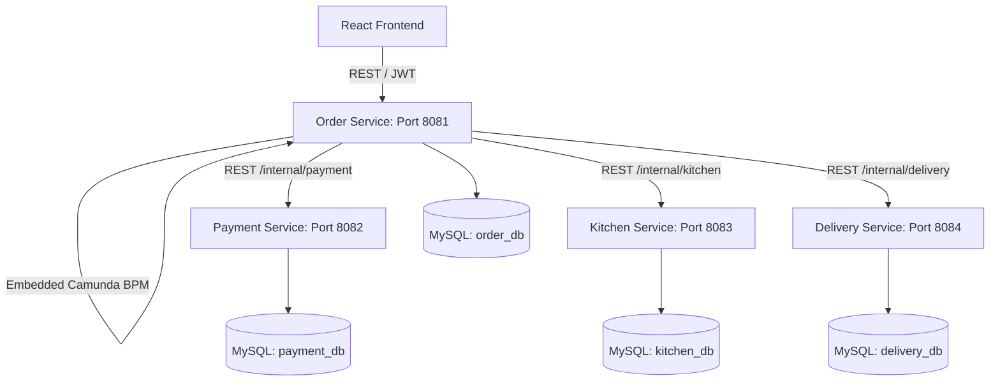
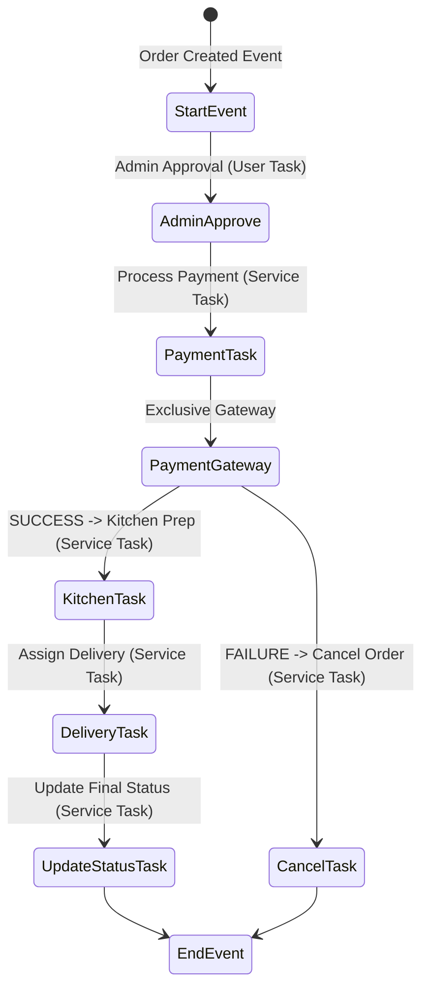
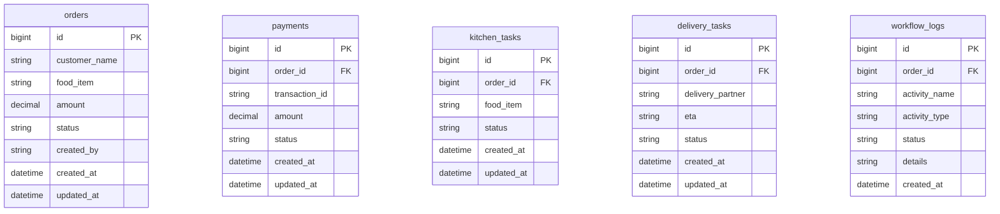

# Online Food Order Processing System

A complete production-quality microservices application for online food order orchestration. Built with Spring Boot, Camunda BPM, MySQL, and a modern React UI.

---

## System Architecture

The application is structured as a collection of core microservices, integrated using in-process Spring ApplicationEvents and orchestrated end-to-end via an embedded Camunda 7 Workflow Engine in the Order Service.



---

## Order Lifecycle & Camunda BPMN Workflow

The order processing lifecycle transitions through the following states:
`PLACED` ➔ `PAYMENT_PROCESSING` ➔ `Decision (SUCCESS/FAILURE)` 
- **Success:** ➔ `KITCHEN_PREPARING` ➔ `FOOD_READY` ➔ `OUT_FOR_DELIVERY` ➔ `DELIVERED`
- **Failure:** ➔ `CANCELLED`

### Camunda Workflow Orchestration Model

The sequence of service tasks and gate evaluations is defined in the embedded `food-order-flow.bpmn` workflow:



---

## Database Design & ER Diagram

Each microservice governs its own domain-specific database schema in MySQL:



---

## API Documentation

### 1. Order Service (Port 8081)
- **POST `/api/orders`**: Place a new food order.
  ```json
  {
    "customerName": "John Doe",
    "foodItem": "Pepperoni Pizza XL",
    "amount": 18.50
  }
  ```
- **GET `/api/orders`**: Retrieve all orders.
- **GET `/api/orders/{id}`**: Retrieve detailed order info with its Camunda execution logs.
- **POST `/api/auth/login`**: Authenticate administrator and return JWT token.
- **GET `/api/admin/tasks`**: Get active Camunda User Tasks waiting for approval (Requires Admin JWT).
- **POST `/api/admin/tasks/{taskId}/complete`**: Manually approve a task and resume workflow (Requires Admin JWT).

### 2. Payment Service (Port 8082)
- **POST `/internal/payment`**: Process transaction (80% Success, 20% Failure).

### 3. Kitchen Service (Port 8083)
- **POST `/internal/kitchen`**: Prepare food and return `FOOD_READY` status.

### 4. Delivery Service (Port 8084)
- **POST `/internal/delivery`**: Assign courier, generate ETA, and return `DELIVERED` status.

---

## Installation & Deployment Guide

### Prerequisites
- Node.js (v18+)
- Java 21 & Maven 3.8+ (for local builds)
- MySQL Server 8.0+
- ActiveMQ Classic (v6.0+) OR Docker / Docker Compose

### Option 1: Run with Docker Compose (Recommended)
You can start the entire stack (all 4 Spring Boot microservices, React UI, MySQL, and ActiveMQ Classic) with a single command from the root directory:

```bash
docker-compose up --build
```
- Access the **React Web UI** at: `http://localhost:3000`
- Access the **Order Service API Docs** at: `http://localhost:8081/swagger-ui/index.html`
- Access the **Camunda Cockpit** at: `http://localhost:8081/camunda/` (Admin credentials: `admin` / `admin`)
- Access the **ActiveMQ Web Console** at: `http://localhost:8161` (Admin credentials: `admin` / `admin`)

### Option 2: Run Services Locally (Development Mode)
If running outside Docker:
1. Ensure your local MySQL instance is running and has the databases: `order_db`, `payment_db`, `kitchen_db`, `delivery_db`.
2. Configure credentials in the respective `application.properties` (Default database password: `Arul@1234`).
3. Build the backend using Maven:
   ```bash
   mvn clean package
   ```
4. Run each service individually using:
   ```bash
   java -jar target/[service-name]-1.0.0.jar
   ```
5. Run the frontend react-app:
   ```bash
   cd frontend/react-app
   npm install
   npm run dev
   ```

---

## Security & Admin Credentials
- **Admin Panel URL**: Navigate to `/admin` in the browser or click "Admin Login" in the Navigation Bar.
- **Login Credentials**:
  - **Username**: `admin`
  - **Password**: `admin123`


# 🚀 Production Cloud Deployment Checklist

To deploy the Spring Boot backend (`order-service`) to Render:

### Step 1: Provision a Managed MySQL Database
Create a MySQL database (e.g. via Aiven, AWS RDS, or any MySQL provider) and record the following credentials:
- **Host / URL**: e.g., `mysql://<host>:<port>/order_db`
- **Username**: e.g., `root` or `<custom_user>`
- **Password**: e.g., `<db_password>`

### Step 2: Create a Web Service on Render
1. Log into your Render Dashboard.
2. Click **New +** ➔ **Web Service**.
3. Connect your GitHub repository: `https://github.com/Arulmurugan-p/wafforproject-food-delivery`.
4. Configure the service settings:
   - **Name**: `order-service`
   - **Region**: Select your preferred region (e.g., Oregon)
   - **Branch**: `main`
   - **Root Directory**: `backend/order-service`
   - **Runtime**: `Docker`
5. Click **Advanced** to add the following **Environment Variables**:

| Variable Name | Value / Format | Purpose |
|---|---|---|
| `SPRING_DATASOURCE_URL` | `jdbc:mysql://<host>:<port>/order_db?useSSL=true&allowPublicKeyRetrieval=true` | JDBC Connection URL to your MySQL Database |
| `SPRING_DATASOURCE_USERNAME` | `<db_username>` | MySQL username |
| `SPRING_DATASOURCE_PASSWORD` | `<db_password>` | MySQL password |
| `PORT` | `8081` | Container port matching internal bindings |

6. Click **Create Web Service**.

### Step 3: Configure Frontend on Vercel
In your Vercel Project Settings for the frontend app:
1. Add a new **Environment Variable**:
   - **Key**: `VITE_API_BASE_URL`
   - **Value**: `https://[your-render-service-name].onrender.com` (Your Render Web Service URL)
2. Redeploy the frontend.

---

## Tech Stack
- React + Vite
- Java 21
- Spring Boot
- MySQL
- Camunda BPM
- Docker
